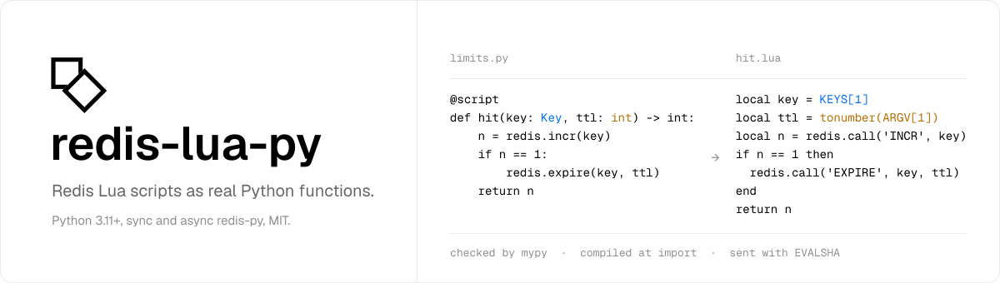

<p align="center">
  <picture>
    <source media="(prefers-color-scheme: dark)" srcset="./.github/assets/banner-dark.svg">
    
  </picture>
</p>

<p align="center">
  <a href="https://pypi.org/project/redis-lua-py/"></a>
  <a href="https://pypi.org/project/redis-lua-py/"></a>
  <a href="https://github.com/ignacemaes/redis-lua-py/actions/workflows/ci.yml"></a>
  <a href="./LICENSE"></a>
</p>

<p align="center">
  Write Redis Lua scripts as real Python functions, not as strings.<br>
  Compiled at import, checked by <code>mypy</code>, sent with <code>EVALSHA</code>. Sync and async redis-py, and coredis.
</p>

<p align="center">
  <b><a href="https://ignacemaes.com/redis-lua-py/">Documentation</a></b> ·
  <a href="https://ignacemaes.com/redis-lua-py/quickstart/">Quickstart</a> ·
  <a href="https://ignacemaes.com/redis-lua-py/reference/api/">API reference</a> ·
  <a href="./CHANGELOG.md">Changelog</a>
</p>

```python
from redis_lua_py import Key, redis, script


@script
def rate_limit(key: Key, limit: int, ttl: int) -> int:
    current = redis.incr(key)
    if current == 1:
        redis.expire(key, ttl)
    if current > limit:
        return -1
    return limit - current
```

The body is never executed by Python. It is read as source when the module is
imported, compiled to Lua, and sent to Redis with `EVALSHA`. Your editor
highlights it, your linter sees it, and `mypy` checks the signature — none of
which is true of a string.

Define scripts at module level, where they compile once at import. A script
defined inside a function recompiles on every call, and one defined through
`exec` has no source to read and is refused.

```python
from redis import Redis

client = Redis()
remaining = rate_limit(client, key="user:42", limit=10, ttl=60)
```

Importing the client as `from redis import Redis` leaves the name `redis` free
for the script namespace, so the two never collide.

## Install

```bash
uv add redis-lua-py
```

Python 3.10+, and no dependencies: bring your own client, redis-py 4.2+ or coredis.

## What it compiles to

Nothing is hidden. Every script exposes the Lua it produced:

```python
>>> print(rate_limit.lua)
```

```lua
-- rate_limit
-- Generated by redis-lua-py from src/limits.py:6. Do not edit.
local key = KEYS[1]
local limit = tonumber(ARGV[1])
local ttl = ARGV[2]
local current = redis.call('INCR', key)
if current == 1 then
  redis.call('EXPIRE', key, ttl)
end
if current > limit then
  return -1
end
return limit - current
```

Read it in review, paste it into `redis-cli`, check it into a golden test. The
point of this library is to generate Lua you would have been willing to write.

The header is part of the body, and the body is what `EVALSHA` hashes, so the
path in it is relative to your project root rather than absolute — the same
script has the same SHA on a laptop, in CI and in a container, and the server's
script cache is cold once per script rather than once per environment.

## What else it does

- **[Keys and arguments](https://ignacemaes.com/redis-lua-py/guide/keys-and-arguments/)** —
  a parameter annotated `Key` becomes `KEYS`, which is what Redis Cluster
  routes on; an `int` or `float` is wrapped in `tonumber` for you.
- **[Command names are checked](https://ignacemaes.com/redis-lua-py/guide/calling-redis-commands/)**
  at compile time against Redis' own command table, so `redis.expires(...)` is
  refused where you can see it rather than raised inside a script whose whole
  purpose was to be atomic.
- **[Constants are folded](https://ignacemaes.com/redis-lua-py/guide/constants/)** —
  a module-level `int`, `float`, `str`, `bytes` or `bool` is read once, at
  import, and written into the script as a literal.
- **[Binary values survive](https://ignacemaes.com/redis-lua-py/guide/binary-values/)** —
  nothing here decodes, and `bytes` is a passthrough in both directions.
- **[The caller's side is typed](https://ignacemaes.com/redis-lua-py/guide/return-values/)** —
  a script is a `CompiledScript[R]`, and an async client gives you
  `Awaitable[R]`.
- **[Sync and async](https://ignacemaes.com/redis-lua-py/guide/async/)** from
  the same script object, with redis-py or coredis, and
  **[`bind`](https://ignacemaes.com/redis-lua-py/guide/binding-a-client/)** when
  passing the client every time gets repetitive.
- **[Build-time generation](https://ignacemaes.com/redis-lua-py/guide/build-time/)**
  for libraries — `python -m redis_lua_py generate` writes your scripts to a
  module of typed functions that needs only the standard library, called just
  like the `@script`, so your users never depend on this package. `--check`
  keeps it current in CI.
- **[Redis Functions](https://ignacemaes.com/redis-lua-py/guide/redis-functions/)** —
  the same Python compiles into a function library, loaded with `FUNCTION LOAD`
  on first use and called with `FCALL`, and scripts take Redis 7 flags such as
  `no-writes`.
- **[The gaps between Lua and Python](https://ignacemaes.com/redis-lua-py/reference/lua-vs-python/)**
  are closed or refused — truthiness, 1-based indexing, `false` versus `nil`,
  block scope, and the nil that truncates a returned table.
- **[Anything outside the supported subset](https://ignacemaes.com/redis-lua-py/reference/supported-subset/)**
  raises at import, with a caret under the line at fault.

Full documentation: **[ignacemaes.com/redis-lua-py](https://ignacemaes.com/redis-lua-py/)**.

## Testing your scripts

[fakeredis](https://github.com/cunla/fakeredis-py) embeds a real Lua
interpreter, so your script executes for real against an in-process server:

```python
import fakeredis


def test_rate_limit_refuses_past_the_limit():
    client = fakeredis.FakeRedis()

    assert rate_limit(client, key="u:42", limit=2, ttl=60) == 1
    assert rate_limit(client, key="u:42", limit=2, ttl=60) == 0
    assert rate_limit(client, key="u:42", limit=2, ttl=60) == -1
```

Install it with `uv add --dev "fakeredis[lua]"`; the `lua` extra is what brings
the interpreter. `.lua` is the whole script, so a golden snapshot is a string
comparison — see
[Testing your scripts](https://ignacemaes.com/redis-lua-py/guide/testing/).

## Development

```bash
uv sync
uv run pytest
uv run ruff check
uv run mypy
```

Tests run against [fakeredis](https://github.com/cunla/fakeredis-py), which
executes real Lua, so `uv run pytest` needs no server. Set `REDIS_URL` to also
run them against a live Redis:

```bash
REDIS_URL=redis://localhost:6379/0 uv run pytest
```

`src/redis_lua_py/_commands.py` is generated from the Redis source. Refresh it
when a Redis release adds commands:

```bash
uv run python scripts/generate_commands.py 8.10.1
```

The docs site is built with [Zensical](https://zensical.org); `uv run zensical
serve` previews it with live reload.

Pull requests are squash-merged and their titles must follow
[Conventional Commits](https://www.conventionalcommits.org/): the title becomes
the changelog entry and decides the version bump. See
[CONTRIBUTING.md](CONTRIBUTING.md).

## License

MIT
